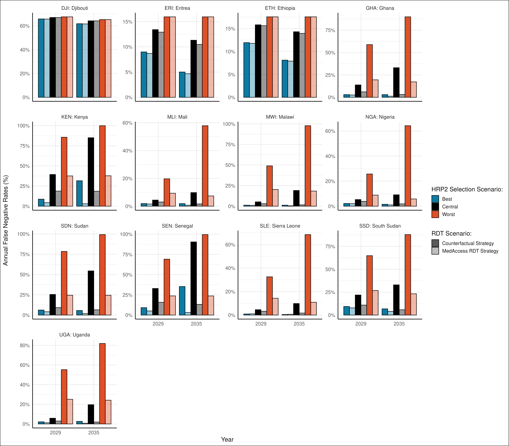

## Background

The spread of *pfhrp2/3* gene deletions in *Plasmodium falciparum* threatens the effectiveness of HRP2-based malaria rapid diagnostic tests (RDTs). These deletions lead to false-negative results, contributing to undiagnosed malaria cases, increased transmission, and higher mortality. In [Watson et al. 2024](https://pubmed.ncbi.nlm.nih.gov/37905102/), the spread of the deletions was forecast in Africa, identifying regions where false-negative rates would exceed the 5% threshold.

This analysis evaluates the public health impact of implementing volume guarantees for novel combined LDH/HRP2-based RDTs compared to a counterfactual scenario where countries continue using HRP2-only RDTs. The MedAccess strategy aims to transition countries to novel RDTs in high-risk regions, mitigating the public health burden.

## Methods

The analysis uses the Watson et al. 2024 mathematical model of malaria transmission, expanded to simulate *pfhrp2/3* deletion dynamics under two scenarios:

* Counterfactual Strategy: HRP2-only RDTs are continued despite crossing the 5% false-negative threshold.

* MedAccess Strategy: Under this strategy, any administrative region reaching the 5% threshold for *pfhrp2/3* deletions triggers the phased introduction of novel mRDTs. The simulation begins in 2024, allowing for phased transitions:

  * Regions exceeding the 5% threshold introduce novel mRDTs the following year, starting with 25% of a country’s RDT use being replaced.

  * By the second year of transition, another 25% of RDTs are switched to novel mRDTs, bringing the total to 50%.

  * In the third year, the remaining RDTs are switched, achieving 100% coverage of novel mRDTs. Exceptions include Ethiopia, Eritrea, and Djibouti, which have already switched entirely to novel mRDTs and maintain 100% coverage throughout the simulation.

  * From 2027 to 2032, all other malaria-endemic countries switch to novel mRDTs incrementally, beginning with 16.5% coverage in 2027 and increasing by 16.5% annually until full coverage is reached by 2032.

  * Regions reaching the 5% threshold after 2027 follow this incremental rollout schedule.

Simulations forecast annual false-negative rates and the reductions achieved by switching to novel RDTs. Key outcomes include the percentage of averted false-negative cases and regional trends in the impact of the MedAccess strategy.

## Results

The MedAccess strategy shows a substantial reduction in false-negative rates compared to the counterfactual scenario, where HRP2-only RDTs remain in use despite increasing *pfhrp2/3* deletions. In the counterfactual strategy, false-negative rates are projected to rise to over 40% in a number of countries by 2035, with the worst-case scenario reaching nearly 50%. Conversely, the MedAccess strategy successfully limits false-negative rates to under 20% across all scenarios, highlighting its potential to mitigate diagnostic failures caused by *pfhrp2/3* deletions.

The MedAccess strategy achieves the most significant reductions in false-negative rates during the early years of novel RDT rollout, particularly in regions that adopt these diagnostics promptly with respect to the emergence and spread of deletion. For example, countries such as Ethiopia, Ghana, and Kenya, demonstrate a sharp decline in false-negative rates by 2029 in comparison to the counterfacatual. This early intervention underscores the importance of prioritising high-risk regions to maximise public health benefits. However, the impact of these interventions remains modest by 2029 for a number of countries expected to select for deletions more slowly, reflecting the time required for deletions to spread and be selected for in the absence of diagnostic changes.

The analysis also demonstrates the cumulative impact of the MedAccess strategy in terms of averted false-negative cases. The percentage of cases prevented due to the strategy, with the greatest impact observed in high-burden countries transitioning to novel RDTs during the first phase of implementation. By 2035, the MedAccess strategy has averted a substantial proportion of false-negative cases compared to the counterfactual when viewed across Africa as a whole.

Specific comparisons at year 2029 and 2035, shows the comparatively smaller impact of the MedAccess voume guarantee by 2029 (except in the worst HRP2 selection scenario, where significant impact is observed for a number of priority countries). The figure below highlights how a number of priority countries such as Ghana, Senegal and Kenya, which benefit earlier than other countries such as Uganda. This is due to the difference in the speed of selection, with the impact of *pfhrp2/3* deletions being observed only later in the counterfactual strategy in countries like Ugands. However, by 2035, significant impacts of the volume guarnatee are seen across all countries by 2035. 

## Conclusion

The MedAccess strategy demonstrates clear benefits in reducing false-negative rates, particularly in high-risk regions that are yet to switch. While the impact of these strategies is apparent by 2029, it remains considerably smaller than the reductions achieved by 2035, reflecting the time taken for deletions to spread and be selected for. Despite this, significant impact is still observed by 2029, with early transitions to novel mRDTs likely to mitigate the public health burden posed by *pfhrp2/3* deletions.
