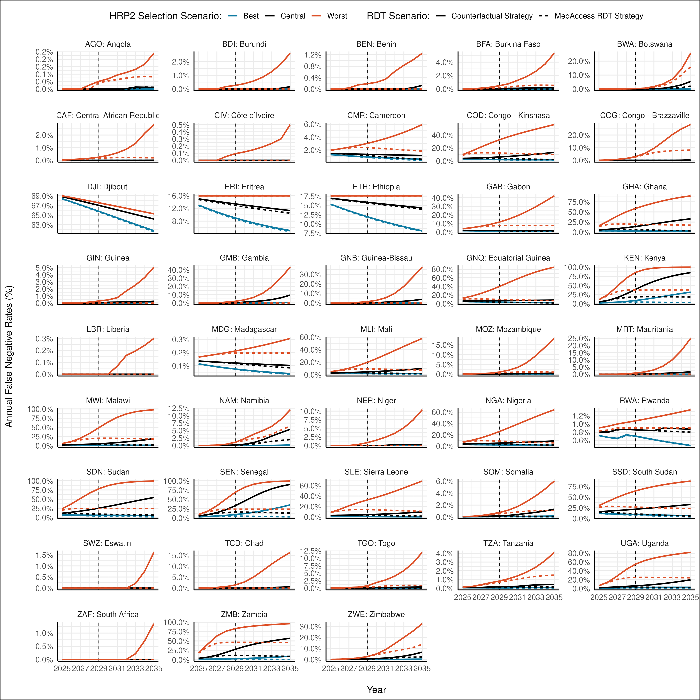
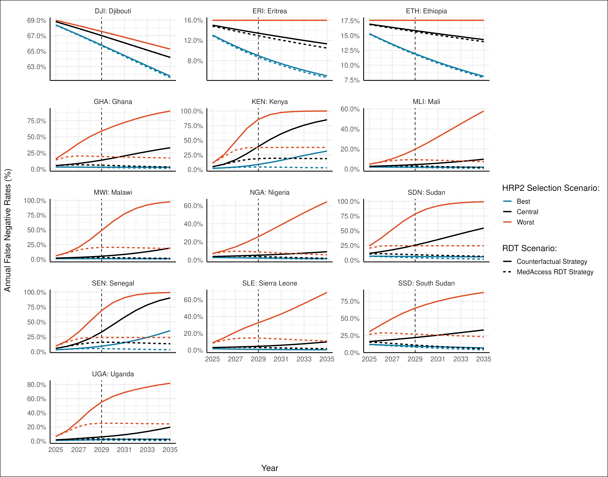
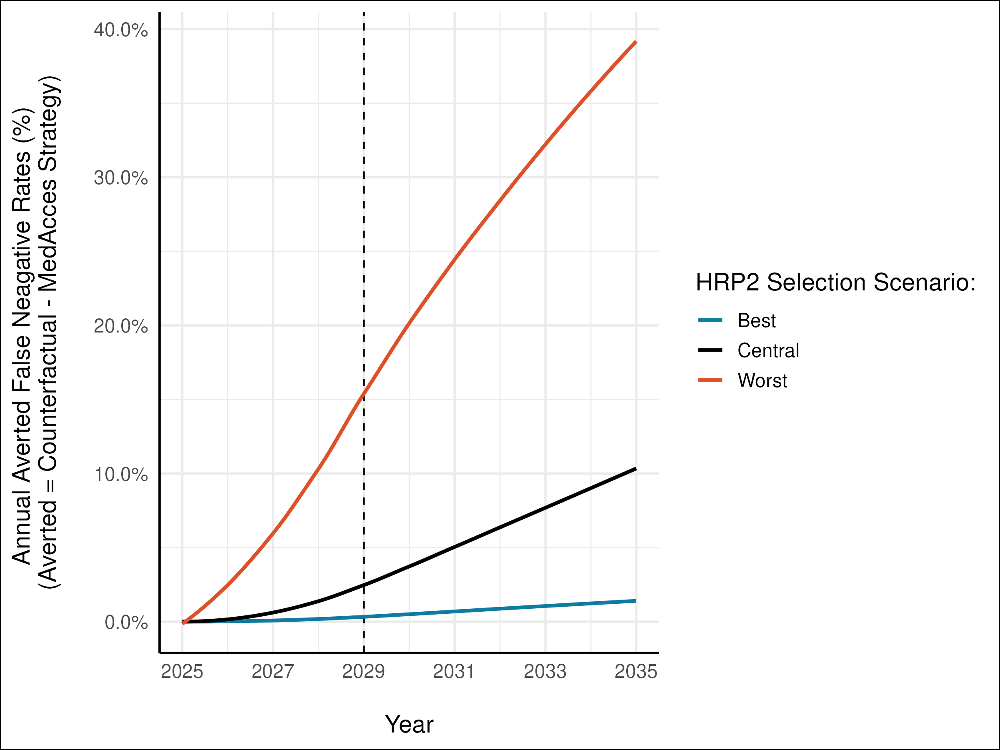

## Background {.smaller}

::: columns
::: {.column width="50%"}
- *Pfhrp2/3* deletions reduce effectiveness of HRP2-based RDTs.
- False negatives increase undiagnosed cases, leading to higher transmission.
- Watson et al. (2024) projected high-risk regions exceeding a 5% false-negative rate.
- MedAccess aims to introduce novel LDH/HRP2-based RDTs to mitigate public health risks.
:::

::: {.column width="50%"}

:::
:::

---

## Methods  {.smaller}

::: columns
::: {.column width="50%"}
- **Counterfactual Strategy**: HRP2-only RDTs remain in use despite reaching high false-negative rates.
- **MedAccess Strategy**:
  - Regions exceeding 5% false negatives start phased mRDT introduction.
  - 25% of RDTs replaced in year 1, 50% in year 2, 100% in year 3.
  - Full transition in Ethiopia, Eritrea, and Djibouti.
  - From 2027–2032, other endemic countries transition incrementally.
:::

::: {.column width="50%"}

:::
:::

---

## Results: Overall False-Negative Rates {.smaller}

::: columns
::: {.column width="50%"}
- MedAccess reduces false-negative rates significantly.
- Counterfactual strategy sees rates exceed 40% in high-burden countries by 2035.
- MedAccess strategy keeps false-negative rates below 20%.
:::

::: {.column width="50%"}

:::
:::

---

## Results: Priority Countries {.smaller}

::: columns
::: {.column width="50%"}
- Greatest impact in early adopters (Ethiopia, Ghana, Kenya).
- Sharp declines in false-negative rates by 2029.
- Some countries with slower selection see improvements later.
:::

::: {.column width="50%"}

:::
:::

---

## Results: Averted False-Negative Cases {.smaller}

::: columns
::: {.column width="50%"}
- MedAccess reduces the cumulative burden of false-negative cases.
- Highest impact in countries transitioning earliest.
- By 2035, substantial cases are averted across sub-Saharan Africa.
:::

::: {.column width="50%"}

:::
:::

---

## Results: Regional Comparisons {.smaller}

::: columns
::: {.column width="50%"}
- Timing of selection affects strategy impact.
- Early adopters (Ghana, Senegal, Kenya) benefit quickly.
- Later adopters (Uganda, slower-selection countries) see delayed impacts.
- By 2035, all priority countries experience major improvements.
:::

::: {.column width="50%"}

:::
:::

---

## Conclusion {.smaller}

::: columns
::: {.column width="50%"}
- MedAccess reduces false-negative rates, particularly in high-risk regions.
- Impact is evident by 2029 but significantly stronger by 2035.
- Early transitions to novel mRDTs play a crucial role in mitigating the public health burden posed by *pfhrp2/3* deletions.
:::

::: {.column width="50%"}

:::
:::

---

## Thank You
